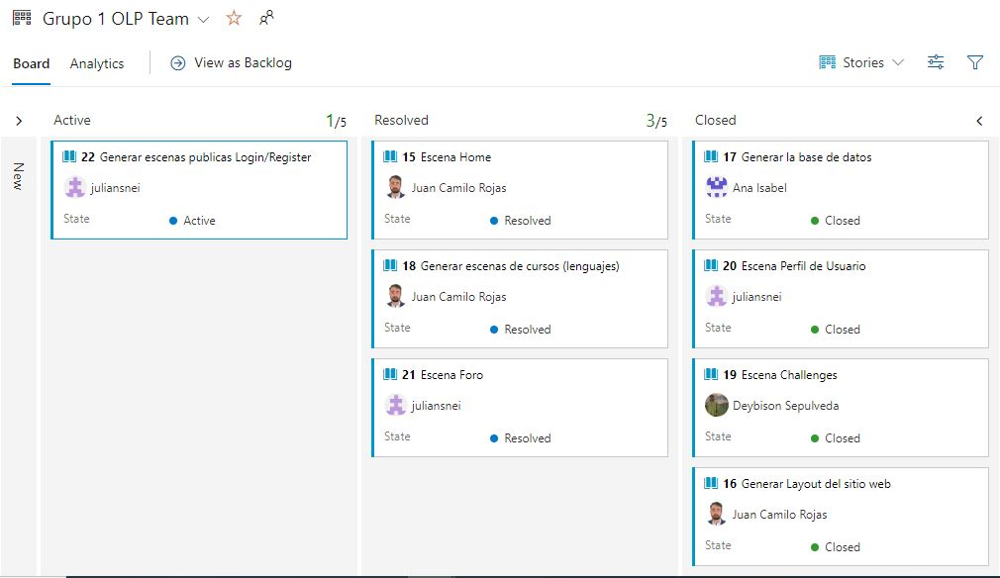
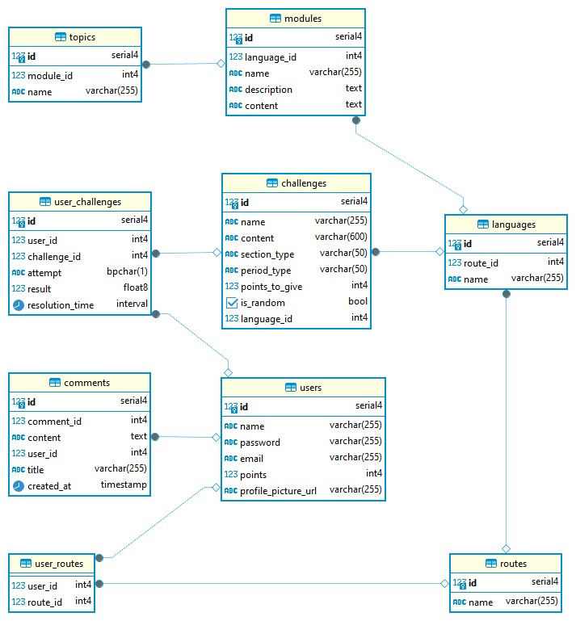

# CodeQuest Project Documentation

## General Objective

The primary objective of CodeQuest is to create an engaging online learning platform that teaches HTML, CSS, and JavaScript through gamification. By incorporating interactive games and hands-on coding exercises, CodeQuest aims to make learning programming languages an enjoyable and effective experience. The platform also aims to expand its offerings by adding more programming languages in the future.

## Project Statement

CodeQuest addresses the challenge of making learning programming languages accessible, engaging, and effective for beginners. Traditional methods of learning to code can be dry and overwhelming, especially for those new to the field. CodeQuest seeks to transform the learning experience by incorporating gamification techniques, which increase motivation and retention by turning the learning process into an enjoyable and interactive journey. Through a series of coding games and practical exercises, users can learn by doing, which helps reinforce their understanding and builds practical skills.

## Project Scope

### Short-Term (Demo Version)

- Develop a demo version of CodeQuest focusing on HTML, CSS, and JavaScript.
- Implement basic gamification elements such as points, badges, and levels.
- Include a few sample games and coding exercises to demonstrate the learning approach.

### Medium-Term

- Integrate database connectivity to support user accounts, progress tracking, and personalized learning paths.
- Expand the platform to include additional modules and more programming languages.
- Enhance the range of interactive games and exercises available for each programming language.

### Long-Term

- Develop advanced gamification features to increase user engagement, such as leaderboards, competitions, and collaborative challenges.
- Improve the interactivity of the platform by incorporating real-time feedback, peer reviews, and community features.
- Continuously update and expand the curriculum to cover new programming languages and emerging technologies.

## Project Description

CodeQuest is an online learning platform designed to teach programming languages like HTML, CSS, and JavaScript through gamification. The platform provides users with a series of games and hands-on coding exercises that allow them to learn by developing small programs directly within the web interface. Each programming language module is structured to progressively build the user's skills, starting from basic concepts and moving to more advanced topics. By completing challenges and earning rewards, users stay motivated and can track their progress throughout their learning journey.

CodeQuest's future vision includes the addition of more programming languages and the implementation of advanced gamification techniques to further enhance user engagement and learning outcomes. The platform's ultimate goal is to make coding education accessible, enjoyable, and effective for learners of all levels.

# User Stories Dashboard

## Epics

### Epic 1: Basic Game Systems
- **Description**:
  - **User Profile**:
    - **General Information**: View basic information and progress in their profile.
    - **Profile Path**: Display the user's path, language, and level.
  - **Learning Paths**:
    - **Create Entities**: Path > Language > Module > Topic.
    - Relate paths to programming languages.
  - **Interactive Games**:
    - **Types of Games**: 
      - Quiz Games.
      - Practical and Collaborative Challenges.
    - **Scoring**: Award points for each completed activity.
  - **Gamification and Points System**:
    - **Points and Medals System**:
      - Award points for completed activities.
      - Create a system of medals and trophies.

### Epic 2: Challenges
- **Description**:
  - Create a challenge page focused on HTML, CSS, and JavaScript.
  - The challenges should be daily, weekly, and monthly.
  - Challenges should have points associated with them.
  - An admin user should be able to create new challenges.
  - Challenges should be displayed randomly.
 
### Epic 3: Forum
- **Description**:
  - Add a page to display a forum.
  - Comments should be stored in a database and displayed in real-time.
  - The forum view should include a post and allow responses to the post.
  - The forum view should have a leaderboard of users based on their progress on the platform.

# User Stories

## User Story 1: Generate Website Layout
**Description**: Generate a layout for the website with a sidebar, navbar, footer, and main scene using the SPA architecture proposed for the OLP project by the Ritchie clan. The layout should cover the entire viewport of the website and be responsive.

## User Story 2: Home Scene
**Description**: Generate a main view of the page based on the solar system. The view should include animations, information related to the page's content, and links that lead to each of the learning sites on the platform.

## User Story 3: User Profile Scene
**Description**: The scene should contain user information such as name, email, role, progress, and photo. Additionally, the scene should allow updating this information with the database.

## User Story 4: Forum Scene
**Description**: Generate a forum scene connected to the database in real-time, storing comments and responses. Additionally, it should display a leaderboard of users based on their progress.

## User Story 5: Challenges Scene
**Description**: Generate a challenges scene. The admin user should be able to add challenges to the scene in real-time. The scene should be interactive and animated. Challenges should display a name, points earned, and description.

## User Story 6: Generate Course Scenes (Languages)
**Description**: Generate interactive scenes for HTML, CSS, and JavaScript courses. The admin user should be able to add new learning modules. Each module should display a title, description, content, and a game related to the module's topic.

## User Story 7: Generate Public Login/Register Scenes
**Description**: Add two public scenes to the platform: login and register. The scenes should allow users to register in the database and log in with their credentials to the platform. User information should be sent encrypted to the server.

## User Story 8: Generate the Database
**Description**: The database should have entities such as users, languages, modules, comments, and challenges. Use the CRUD method.

## Protype

Know more about our mockup version in: https://www.figma.com/design/ZaxjkfUiaNcFyQGUS0p5HV/UntitlVista-Home-proyecto-(Copy)?node-id=0-1&t=o41pRJZc43CNJnyk-0

## Entity-Relationship Diagram

